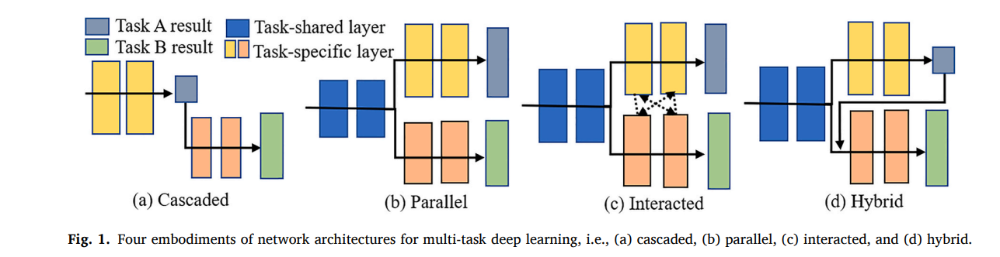
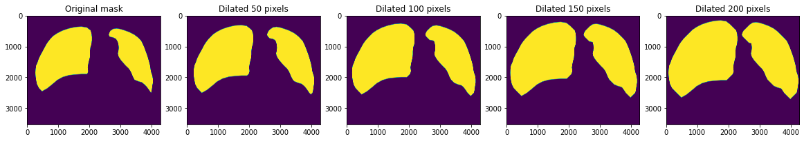
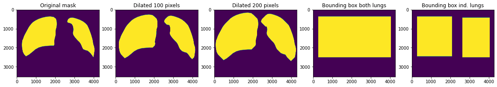

# Multi-task learning and segmentation mask analysis

## Weekly log

### Week 43

This week Casper is looking into 3 different multi-task setups that he would like to investigate. 

- The 1st is a simple parallel 2 head architecture where the first head is trained to perform tube detection and then the second head is trained to perform pathology detection. 

- The 2nd is also a parallel architecture but with 3 heads like in (insert citation). The first task would be to a segmentation task of the lungs, the second would be tube detection and the final would be pathology detection

- The 3rd would be a hybrid of a cascade and parallel architecture. The first head performs object detection of the lungs and draws a bounding box around them. This bounding box is then used to crop out the parts of the picture that do not contain lungs, while still keeping the picture sqaure and symmetrical. These cropped images are then fed back into the network to train two heads (TD and PD respectively). 
The first task could also be segmentation, where everything but the lungs are cropped out. The difference between the previous paper and this architecture would be the task-shared layers between the segmenter and the other tasks, as well as the labels being from ChestXray-14 using the augmentations we made, instead of crowd annotated masks. 

 

One important part for me is to explore if any of these architectures gets closer to archieve equalized odds in respect to people with tubes, when performing pathology detection.

### Week 41-42

This week we applied the functions we created last week to all ~160k masks from the ChestX-ray14. The images are of varying sizes and aspect ratios, so we came up with a function to standardize dilation rates according to the total number of pixels in the image. We dilate the masks in 4 increments, with the increment size being a function $ max ( Npixels/300000, 1) $ so for a picture of size $3520 x 4280$ the increment size would be $50$, these increments look like this: 

 

We have also been training the PD and PD-multi-task models. Casper is currently looking into alternate multi-task architectures in https://doi.org/10.1016/j.compbiomed.2022.106496. Michelle is continuing works on adapting the get_preds script to get predictions from the PD model on images treated with the new masks. 

### Week 40

We made functions for adjusting existing segmentation masks in the ChestX-ray14 data set. These functions can adjust masks by expanding the borders of the induvidual lungs and draw bounding boxes either around the lungs collectively or induvidually as seen in this image: 

 

The functions can be found in Segmentation_preprocessing/Segmentation_mask.ipynb .
Next week Casper will be focusing on applying these functions on the dataset as well as training the PD and multi-task models, while Michelle works on adapting the get_preds script to get predictions from the PD model on images treated with the new masks. 

### Week 39

Setting up conda environments, git repo and jobs on HPC

## Multi-task learning reading list

### Multi-task Learning for Chest X-ray Abnormality Classification on Noisy Labels

Link : https://arxiv.org/pdf/1905.06362.pdf

Data : ChestX-Ray14 and PLCO

Tasks: Spatial (detection) classification, Abnormality classification and Heart/Lung segmentation

Model: Densenet

### ENHANCE (ENriching Health data by ANnotations of Crowd and Experts): A case study for skin lesion classification

Link : 2021:020.pdf (melba-journal.org) 

Data : ISIC and PH2

Tasks: Abnormality classification and segmentation

Model: Ensemble of VGG-16, Inception v3 and ResNet50

### Multi-task Ensembles with Crowdsourced Features Improve Skin Lesion Diagnosis
Link: https://arxiv.org/pdf/2004.14745.pdf

Data : ISIC

Tasks : Abnormality classification and asymmetry, border or color classification

Model : VGG-16

### Multi-task driven explainable diagnosis of COVID-19 using chest X-ray images

Link : https://doi.org/10.1016/j.patcog.2021.108243

Data : 

Tasks :

Model : 

### Rethinking Computer-Aided Tuberculosis Diagnosis
Link : https://ieeexplore.ieee.org/document/9156613

Data : TBX11K

Tasks : Object detction and abnormality classification

Model : ImageNet

## Segmentation masks reading list

### AI recognition of patient race in medical imaging: a modelling study
Link : [https://ieeexplore.ieee.org/document/9156613](https://www.thelancet.com/journals/landig/article/PIIS2589-7500(22)00063-2/fulltext)

Data : 

Tasks : 

### PadChest Data set
Link: https://www.sciencedirect.com/science/article/abs/pii/S1361841520301614?via%3Dihub

### CheX data set 
Link: https://arxiv.org/abs/2307.03293

### Debiasing Skin Lesion Datasets and Models? Not So Fast
Link: https://arxiv.org/abs/2004.11457

### Assessment of Accuracy of an Artificial Intelligence Algorithm to Detect Melanoma in Images of Skin Lesions

Link: https://jamanetwork.com/journals/jamanetworkopen/article-abstract/2752995

### How Businesses Are Using Artificial Intelligence In 2023
Link: https://www.forbes.com/advisor/business/software/ai-in-business/

###The potential for artificial intelligence in healthcare
Link: https://www.ncbi.nlm.nih.gov/pmc/articles/PMC6616181/

### What Artificial Intelligence Means for Health Care
Link: https://jamanetwork.com/journals/jama-health-forum/fullarticle/2807176

### Minister vil bruge kunstig intelligens og rollebytte til at løse mangel på radiologer og radiografer
Link: https://www.dr.dk/nyheder/indland/minister-vil-bruge-kunstig-intelligens-og-rollebytte-til-loese-mangel-paa-radiologer

